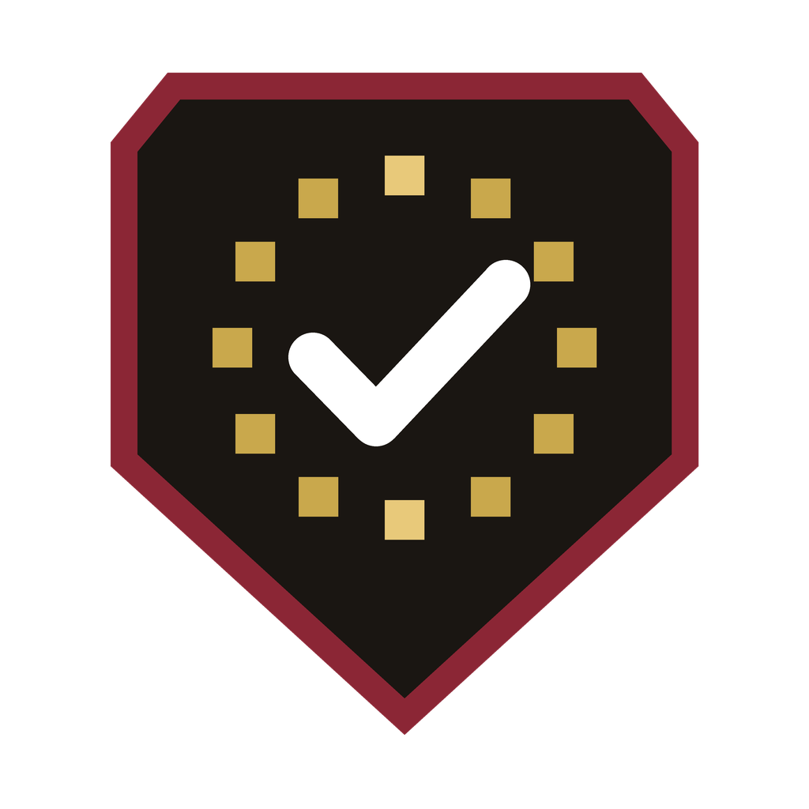

<p align="center"></p>

# GDPRGard Compliance Skills

Seven GDPR working skills and two commands for everyday privacy work, from the team behind [GDPRGard](https://gdprgard.eu). Install it as a plugin (plugin id `gdprgard-compliance`) in [Claude Code](https://claude.com/claude-code).

> **Not legal advice.** The skills produce working drafts and checklists to help you prepare and review. They are a summary of GDPR requirements, not a substitute for your DPO or a qualified lawyer. Check outputs before relying on them.

> **Independent project.** GDPRGard is not affiliated with, endorsed or sponsored by Anthropic. Claude and Claude Code are trademarks of Anthropic.

## Skills

| Skill | What it does |
|---|---|
| `dpia` | Screens whether a DPIA is needed (Art. 35) and drafts one |
| `ropa` | Builds or audits a Record of Processing Activities (Art. 30) |
| `privacy-policy-review` | Checks a privacy policy against Arts. 12-14 |
| `cookie-tracker-audit` | Audits a site's cookies, trackers and consent banner (ePrivacy Art. 5(3)) |
| `dpa-review` | Reviews a processor agreement against Art. 28 and drafts redlines |
| `breach-response` | Guides breach handling and the 72-hour notification (Arts. 33-34) |
| `dsar-response` | Handles data subject requests (Arts. 15-22) |

## Commands

- `/gdprgard-compliance:gdpr-check <path or description>` - prioritised compliance review
- `/gdprgard-compliance:breach <incident>` - start a breach response

## Install

```
/plugin marketplace add zsrrica-pixel/gdpr-compliance-plugin
/plugin install gdprgard-compliance@gdprgard-plugins
```

Restart Claude Code (or run `/reload-plugins`) after installing. To try it without installing, clone the repo and run `claude --plugin-dir <path-to-clone>`.

More on the project page: [gdprgard.eu/gdpr-compliance-skills](https://gdprgard.eu/gdpr-compliance-skills).

## More

Free GDPR tools, guides and templates: [gdprgard.eu](https://gdprgard.eu)

## Contributing

Issues and pull requests are welcome.

**Report a problem or suggest a skill:** open a [GitHub issue](https://github.com/zsrrica-pixel/gdpr-compliance-plugin/issues). For a wrong or outdated legal statement, include the skill name, the passage, and a source (the GDPR article, EDPB guideline or authority decision) that supports the correction.

**Change a skill or command:**
1. Fork the repo and edit the relevant `skills/<name>/SKILL.md` or `commands/<name>.md`.
2. Validate the plugin: `claude plugin validate .`
3. Try it locally: `claude --plugin-dir .`, then run the skill on a realistic example.
4. Open a pull request describing what changed and why.

**Guidelines**
- Cite the GDPR article or guidance a check is based on, and keep the "working draft, not legal advice" framing.
- Make skills handle missing facts by listing open questions, not by guessing.
- Keep each skill focused on one task, with a clear output format (table, findings list, draft text).
- Never put personal data, real customer details or credentials in examples.

## License

[MIT](LICENSE)
